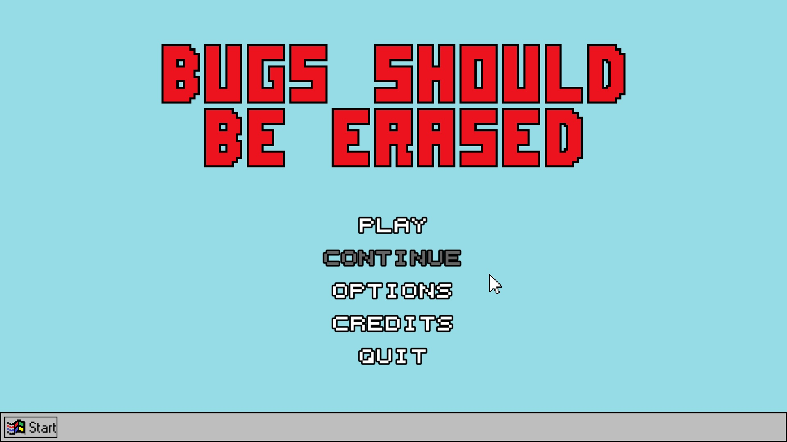
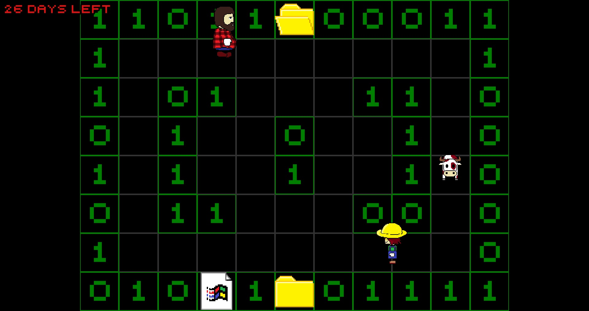

# Bugs-Should-Be-Erased

Bugs Should Be Erased is a game project I made with a friend. It's a roguelike game with a simple plot : you're a broken program that's been move into the recycler bin and you have 30 days to get out of it before it deletes you out forever.
## Features
- The game
- Possibility to setup display options
- Possibility to setup sound options
- Possibility to setup key binding
- Possibility to continue a game after quit it if you doesn't close the game
- 2 languages (English or French)
## Installation
1. Download the repository by clicking on `Code > Download ZIP`
2. Extract the ZIP file
3. Run `Bugs Should Be Erased.exe`
## Game Captures
